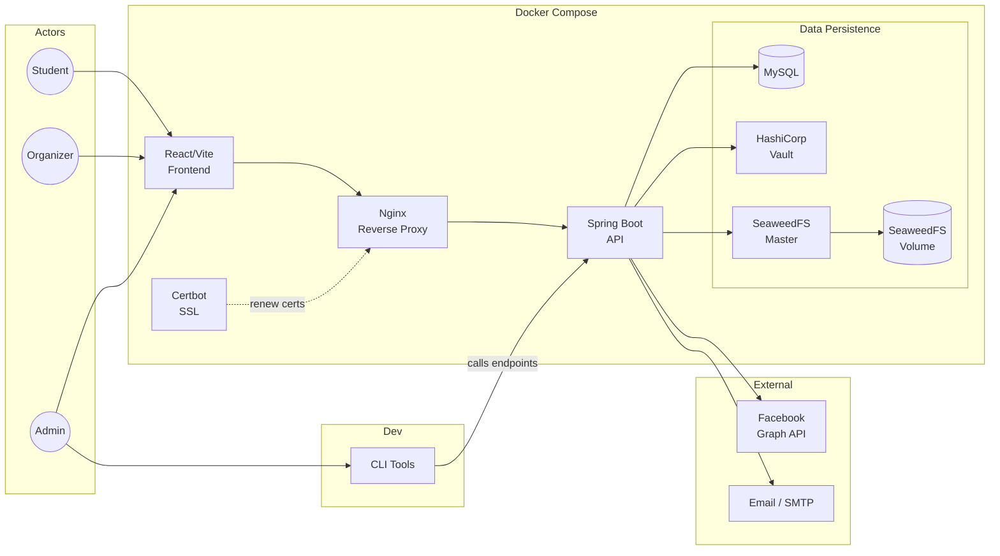
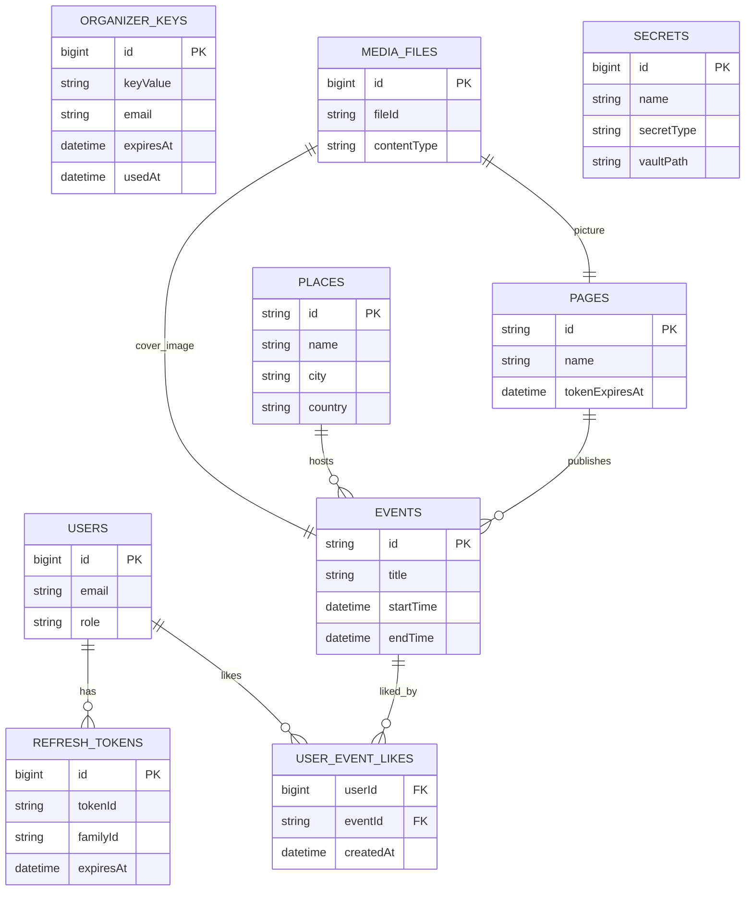
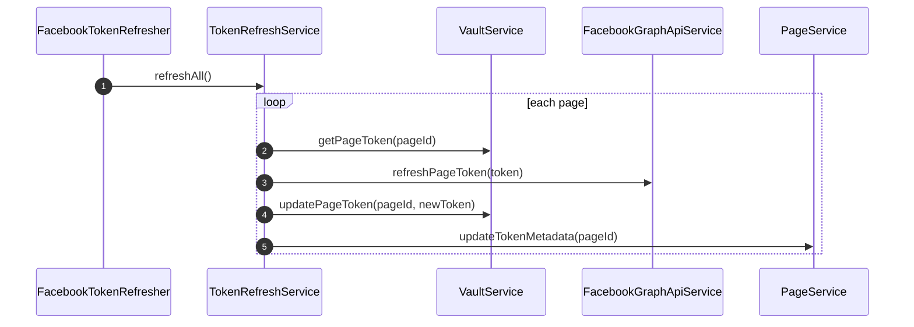
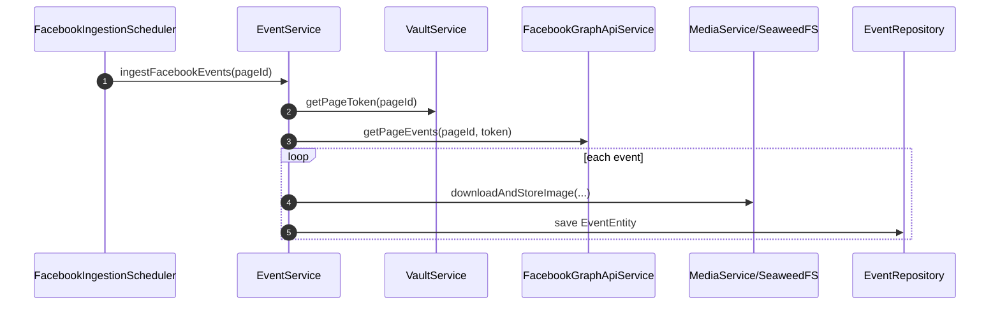
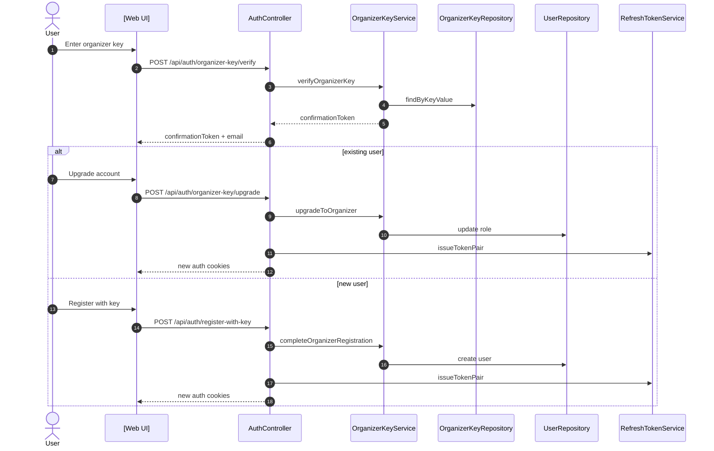

# Contributing
This document is the **technical** part of DTU Event documentation, for general users. For developer and contributor documentation, see [README.md](./README.md).

## Tech Stack

Backend:
- **Java 25** - Language and runtime
- **Maven** - Build tool
- **Docker** - Containerization for the following services:
	- **Spring Boot** - Application framework (Web, Data JPA, Validation, Actuator, OAuth2 Client)
	- **Nginx** - Reverse proxy, HTTPS termination
	- **Certbot** - SSL certificate issuance and renewal
	- **MySQL** - Relational database
	- **HashiCorp Vault** - Secret storage
	- **SeaweedFS** - Media/image storage. Has a Master and Volume.
- **Spring Mail + Thymeleaf** - Email sending with HTML templates
- **Lombok** - Boilerplate reduction
- **SLF4J** - Logging facade
- **JJWT** - JWT token signing and validation
- **SpringDoc OpenAPI** - Auto-generated API docs + Swagger UI (`/swagger-ui.html`)
- **Jackson** - JSON serialization (including JSR310 for Java date/time types)
- **JPA / Hibernate** - ORM
- **H2** - Embedded DB for tests

Frontend:
- **TypeScript 5.8** - Language, a type-safe upgrade to JavaScript
- **Node.js** - Runtime environment
- **npm** - Package manager
- **React 19** - UI framework
- **Vite 7** - Build Tool
- **Tailwind CSS 4** - Styling
- **React Router v7** Routing
- **Lucide React** - Icon library
- **Vitest 4** - Test framework
- **ESLint 9** - Linting

## Setup

Run `pwsh ./tools.ps1 setup`. On Mac/Linux, install PowerShell first. The command will:
- Check required dependencies (Java, Maven, cURL, Docker)
- Check for a root `.env` file, request one from the team if missing
- Generate self-signed TLS certs and create `docker-compose.override.yml` for local HTTPS
- Add `tools` to your PATH so you can run `tools` directly instead of `./tools.ps1`.

After setup the `tools` CLI is available - see `cli/` in the project structure below. To run frontend npm commands (`npm run dev`, `npm run test` etc), `cd` into the web directory

## Project Structure

```text
UniEventServer/
├── .github/
│   └── workflows/
│       └── deploy.yml            # CI/CD: build gates + SSH deploy + docker compose up
├── cli/
│   ├── setup.ps1                 # tools setup
│   ├── docker.ps1                # tools docker / tools docker -d (stop) / tools docker --wipe
│   ├── vault.ps1                 # tools vault, tools unseal
│   ├── seed.ps1                  # tools seed, tools seed --wipe
│   ├── ingest.ps1                # tools ingest [-p <pageId>]
│   ├── refresh.ps1               # tools refresh [-p <pageId>]
│   ├── invite.ps1                # tools invite [-e <email>] [-n <orgname>]
│   ├── status.ps1                # tools status (read-only Docker/Vault summary)
│   └── shared.ps1                # (shared helpers)
├── deploy/
│   ├── nginx-dev.conf            # Local dev
│   └── nginx-https.conf          # Production HTTPS + reverse proxy
├── src/
│   ├── main/
│   │   ├── java/dk/unievent/app/
│   │   │   ├── api/
│   │   │   │   ├── controller/   # HTTP endpoints - routing and status codes only
│   │   │   │   ├── dto/          # Request/Response bodies
│   │   │   │   └── handler/      # Business actions triggered by a request
│   │   │   ├── application/
│   │   │   │   ├── dto/          # Internal data shapes passed between layers
│   │   │   │   ├── mapper/       # @Component beans with toDTO / toEntity
│   │   │   │   ├── scheduler/    # Scheduled tasks (Facebook ingestion, token refresh)
│   │   │   │   └── service/      # Business logic; often getters/setters to an external service
│   │   │   ├── db/
│   │   │   │   ├── model/        # JPA entities
│   │   │   │   └── repository/   # Spring Data interfaces - queries only, no logic
│   │   │   ├── infrastructure/
│   │   │   │   ├── client/       # External HTTP clients (Facebook Graph API, SeaweedFS)
│   │   │   │   ├── config/       # Spring @Configuration beans
│   │   │   │   ├── constants/    # Shared string/numeric constants
│   │   │   │   ├── exception/    # One RuntimeException subclass per failure case
│   │   │   │   ├── filter/       # Servlet filters (auth, CSRF)
│   │   │   │   └── security/     # Spring Security config and JWT
│   │   │   └── tools/            # @Profile("dev") admin endpoints only - never ships to prod
│   │   │       ├── controller/
│   │   │       ├── models/
│   │   │       └── services/
│   │   └── resources/
│   │       ├── db/
│   │       │   └── migration/    # Flyway SQL migrations
│   │       ├── templates/
│   │       │   └── emails/       # Thymeleaf email templates
│   │       ├── api.yaml
│   │       ├── application.yaml
│   │       ├── application-dev.yaml
│   │       ├── db.yaml
│   │       ├── media.yaml
│   │       └── vault.yaml
│   └── test/                    # java tests, mirrors backend structure
├── web/
│   ├── public/
│   ├── src/
│   │   ├── components/          # Purely presentational; no fetch calls, delegate state to hooks
│   │   │   └── admin/
│   │   ├── context/             # App-wide shared state 
│   │   ├── hooks/               # Stateful logic from components (prefixed use*, use[pagename])
│   │   ├── pages/               # Compose components, delegate all state to a useXxxPage hook; near-pure JSX
│   │   │   └── admin/
│   │   ├── services/            # Pure data access: in-memory state, getters/setters, listeners, API calls
│   │   │   ├── http.ts          # Fetch wrapper (auth headers, CSRF, error handling)
│   │   │   ├── csrf.ts          # CSRF token management
│   │   │   ├── dal.ts           # Data Access Layer - all REST API calls
│   │   │   ├── auth.ts          # Cookie-based auth state (in-memory store + session helpers)
│   │   │   ├── facebook.ts      # Facebook OAuth URL builders
│   │   │   └── likes.ts         # Likes persistence (localStorage + in-memory cache)
│   │   ├── styles/              # Tailwind styles
│   │   ├── test/                # Vitest framework, mirrors backend file tree structure
│   │   ├── theme/               # Tailwind design tokens
│   │   ├── utils/               # Pure helpers (no React, no side-effects) used across multiple files
│   │   ├── constants.ts         # All magic values (timeouts, API paths, thresholds, feature flags)
│   │   ├── main.tsx             # Entry point
│   │   ├── App.tsx
│   │   ├── router.tsx           # React Router config
│   │   └── types.ts             # Shared TS types (note: don't exist at runtime, unlike Java/C#)
│   ├── Dockerfile               # Frontend nginx image
│   ├── nginx.conf               # SPA routing (all routes → index.html)
│   ├── package.json
│   └── vite.config.ts
├── docker-compose.yml
├── docker-compose.override.yml.example
├── Dockerfile                   # Backend image
├── pom.xml
└── tools.ps1                    # Entry point for the tools CLI
```

## Diagrams 

### Infrastructure



### Database Schema



### Token Refresh Flow



### Facebook Event Ingestion



### Organizer Key Registration



## API Endpoints

**Public (no auth):**
| Method | Path | Purpose |
|--------|------|---------|
| `GET` | `/api/events` | List all events (paginated) |
| `GET` | `/api/events/future` | Upcoming events only |
| `GET` | `/api/events/{id}` | Single event |
| `GET` | `/api/events/page/{pageId}` | Events for a page |
| `GET` | `/api/events/page/{pageId}/future` | Upcoming events for a page |
| `GET` | `/api/events/place/{placeId}` | Events at a venue |
| `GET` | `/api/pages` | List all pages |
| `GET` | `/api/pages/active` | Active pages only |
| `GET` | `/api/pages/{id}` | Single page |
| `GET` | `/api/pages/search` | Search pages by name |
| `GET` | `/api/places/{id}` | Single place |
| `GET` | `/api/places/city/{city}` | Places in a city |
| `GET` | `/api/places/country/{country}` | Places in a country |
| `GET` | `/api/places/location/{city}/{country}` | Places in a city + country |
| `GET` | `/api/places/search` | Search places by name |
| `GET` | `/api/facebook/auth` | Start Facebook OAuth - returns signed state + auth URL |
| `GET` | `/api/facebook/callback` | Facebook OAuth callback - validates state, exchanges code for tokens |
| `GET` | `/api/facebook/health` | Facebook integration health check |
| `GET` | `/media/{id}` | Download media file |
| `GET` | `/media` | List all media files (paginated) |
| `GET` | `/api/auth/csrf-token` | Get CSRF token (call before login or register) |
| `POST` | `/api/auth/register` | Register user |
| `POST` | `/api/auth/login` | Login |
| `POST` | `/api/auth/refresh` | Refresh access token |
| `POST` | `/api/auth/organizer-key/verify` | Verify organizer invite key |
| `POST` | `/api/auth/register-with-key` | Register as organizer |

**Authenticated:**
| Method | Path | Purpose |
|--------|------|---------|
| `GET` | `/api/auth/profile` | Get current user profile and role |
| `POST` | `/api/auth/logout` | Logout |
| `POST` | `/api/auth/organizer-key/upgrade` | Upgrade existing account to organizer role |
| `POST` | `/api/events` | Create event |
| `PUT` | `/api/events/{id}` | Update event |
| `DELETE` | `/api/events/{id}` | Delete event |
| `POST` | `/api/events/{id}/coverImage` | Upload cover image |
| `POST` | `/api/pages` | Create page |
| `PUT` | `/api/pages/{id}` | Update page |
| `POST` | `/api/pages/{id}/picture` | Upload page picture |
| `DELETE` | `/api/pages/{id}` | Delete page (cascades to events) |
| `POST` | `/api/places` | Create place |
| `PUT` | `/api/places/{id}` | Update place |
| `DELETE` | `/api/places/{id}` | Delete place |
| `POST` | `/media` | Upload media file |
| `GET` | `/api/users/me/likes` | Get liked event IDs |
| `POST` | `/api/users/me/likes` | Merge liked event IDs (sync from localStorage) |
| `PUT` | `/api/users/me/likes/{eventId}` | Like an event |
| `DELETE` | `/api/users/me/likes/{eventId}` | Unlike an event |

**Admin only:**
| Method | Path | Purpose |
|--------|------|---------|
| `POST` | `/api/auth/organizer-key/generate` | Generate organizer invite |
| `GET` | `/api/admin/secrets` | List all secrets |
| `GET` | `/api/admin/secrets/{id}` | Get secret by ID |
| `GET` | `/api/admin/secrets/by-name/{name}` | Get secret by name |
| `GET` | `/api/admin/secrets/by-type/{type}` | Get secrets by type |
| `GET` | `/api/admin/secrets/by-status/{status}` | Get secrets by status |
| `DELETE` | `/api/admin/secrets/{id}` | Delete secret |
| `GET` | `/admin/tools/pages` | List all tracked pages with token status |
| `POST` | `/admin/tools/ingest/{pageId}` | Manually ingest Facebook events for a page |
| `POST` | `/admin/tools/refresh-tokens` | Refresh tokens for all pages |
| `POST` | `/admin/tools/refresh-tokens/{pageId}` | Refresh token for one page |

**Dev profile only (`@Profile("dev")`) - not available in production:**
| Method | Path | Purpose |
|--------|------|---------|
| `POST` | `/admin/tools/seed` | Seed test data |
| `DELETE` | `/admin/tools/seed` | Clear seeded test data |

## TODO

Backend

**Features & Refactor**
- [ ] Rename TokenRefreshService to FacebookTokenRefreshService (also test)
- [ ] JDoc everywhere.
- [ ] Move to OpenAPI 
- [ ] PicoCLI for proper tool CLI
- [ ] DB: Quartz scheduler

**Security**
- [ ] Figure out whether writing keys in console is safe, we need to store keys in a safe place (e.g. password manager) either way
- [ ] Remove insecure JDBC SSL overrides from `db.yaml`; require `serverSslVerification=true` in production
- [ ] Make Vault CA validation mandatory in `vault.yaml`; fail startup if CA cert missing
- [ ] Replace localhost Facebook redirect default in `application.yaml`; require explicit production setting
- [ ] Make CORS validation strict in production; convert warning to startup failure for localhost origins with credentials
- [ ] Force SeaweedFS URLs to HTTPS in `media.yaml`; update `SeaweedFsClient.java` to preserve configured scheme
- [ ] Stop sending organizer confirmation keys in email URLs; use safer delivery path in `EmailService.java`
- [ ] Make email send failures visible in `EmailService.java`; propagate or alert on delivery failures
- [ ] Reduce `SecretController` exposure; disable or restrict metadata endpoints in production
- [ ] Reduce refresh token compromise window in `RefreshTokenService.java`; add immediate access-token revocation
- [ ] Enforce minimum 256-bit entropy for `organizer-key.confirmation-secret` in `ProductionSecretValidator`
- [ ] Add production-profile integration tests for insecure defaults (DB without SSL, Vault without CA, etc.)
- [ ] Harden CLI secret redaction; avoid printing raw JSON responses in CI logs

Frontend

**Feature & Refactor:**
- [ ] Remove /admin/ directory in /web/src/pages; just flatten the folder with no subfolders.
- [ ] AdminHeader, Calendar, HeaderLogoLink, adminTools.ts  should have types in types.ts, consts in constants.ts and functions in a util or 
- [ ] Consolidate styles in /styles into one or two files, and not per page.

**Security**
- [ ] Validate image/media URLs for unsafe schemes; reject `javascript:` and `data:`, allow only `https:` and relative paths
- [ ] Enforce HTTPS backend in production; call `enforceHttpsBackend(BACKEND_URL)` at app bootstrap
- [ ] Replace brittle cookie parsing in `csrf.ts` and tests; use robust parser (e.g., `HttpCookie.parse`)
- [ ] Centralize cookie lifecycle; ensure logout operations use same domain/path/sameSite as creation
- [ ] Audit all error message display paths; ensure backend `message` fields use `sanitizeErrorMessage` before DOM insertion
- [ ] Fix Content-Type auto-injection for file uploads; ensure callers set `headers: {}` or use `FormData`
- [ ] Filter Vite `envDir` to avoid `.env` exposure; document allowed `VITE_*` variables
- [ ] Tighten CSP in nginx config; remove `unsafe-inline` from `style-src`, remove `data:` from `img-src`, limit `connect-src` to API origin
- [ ] Add production-profile integration tests for secure cookie attributes and HTTPS backend
- [ ] Harden `Set-Cookie` parsing in tests; use robust cookie parser instead of substring extraction